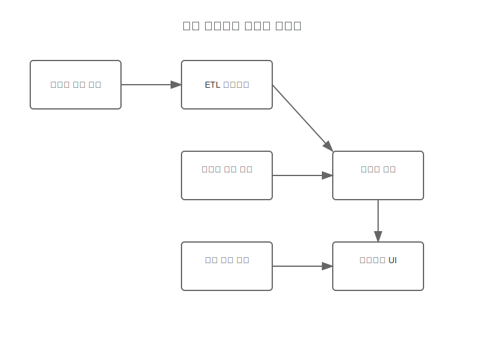

# 분석 대시보드 시스템 흐름 스토리보드

## 개요
분석 대시보드 확장 기능의 데이터 수집, 처리, 시각화 과정을 정의합니다.

## 시스템 구성요소
- 데이터 수집 엔진
- ETL 프로세스
- 실시간 분석 엔진
- 시각화 엔진

## 데이터 흐름

## 연동 지점
1. 이벤트 관리 시스템
2. 게이트 관리 시스템
3. 확장 기능들
4. 외부 분석 도구

## 오류 처리
- 데이터 수집 실패
- 처리 지연
- 시각화 오류
- 메모리 부족

## 관련 시나리오
- [분석 데이터 흐름](../../../../scenarios/extensions/analytics-dashboard/system-scenarios/analytics-flow.md)
- [실시간 분석 처리](../../../../scenarios/extensions/analytics-dashboard/system-scenarios/realtime-analytics.md)

## 시스템 다이어그램

## UI 참조
- [데이터 수집 화면](../../../../user-flows/core-features/images/analytics-dashboard/dashboard-main.svg)
- [분석 대시보드](../../../../user-flows/core-features/images/analytics-dashboard/event-analysis.svg)
- [실시간 모니터링](../../../../user-flows/core-features/images/analytics-dashboard/realtime-monitoring.svg)

