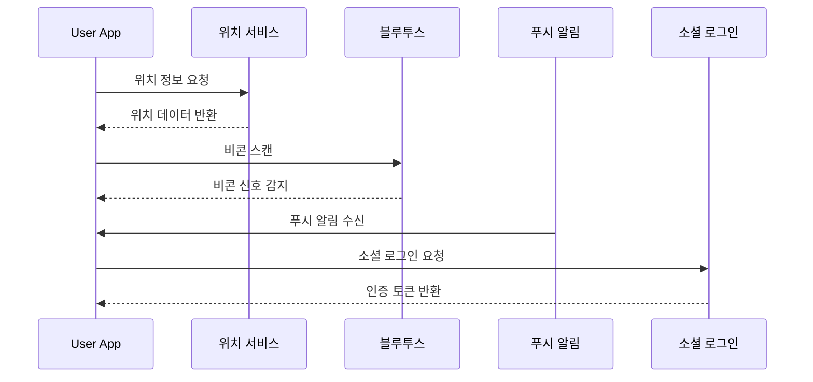
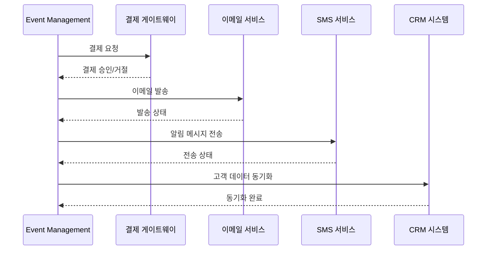
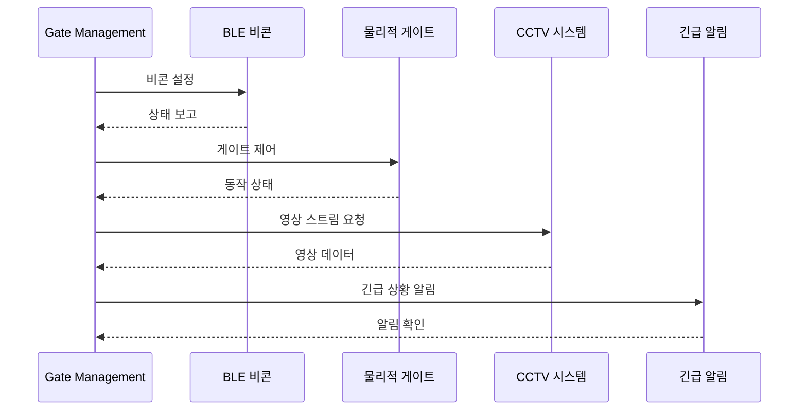
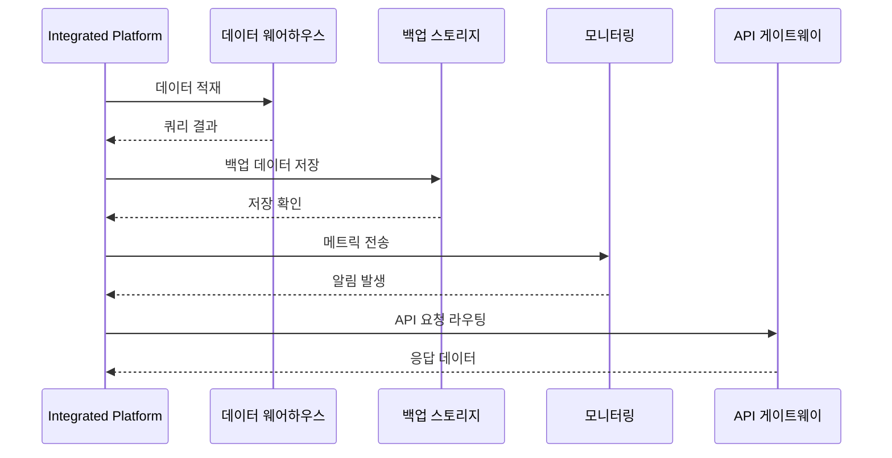

# 외부 시스템 통신 흐름

## 개요

s-attend-gate 시스템의 각 구성 요소가 외부 시스템과 통신하는 흐름을 시각화합니다.

## User App 통신 흐름

### 핵심 통신 포인트
1. 위치 기반 서비스
   - GPS 위치 추적
   - 게이트 근접 감지
   - 위치 데이터 캐싱

2. BLE 통신
   - 비콘 신호 스캔
   - 신호 강도 측정
   - 범위 계산

3. 푸시 알림
   - 토큰 관리
   - 알림 수신/표시
   - 백그라운드 처리

## Event Management 통신 흐름

### 핵심 통신 포인트
1. 결제 처리
   - 결제 요청/승인
   - 환불 처리
   - 정산 관리

2. 커뮤니케이션
   - 대량 메일 발송
   - SMS 알림
   - 상태 추적

3. CRM 연동
   - 고객 데이터 동기화
   - 이벤트 정보 공유
   - 마케팅 자동화

## Gate Management 통신 흐름

### 핵심 통신 포인트
1. 하드웨어 제어
   - 비콘 관리
   - 게이트 동작
   - 센서 모니터링

2. 보안 시스템
   - CCTV 연동
   - 접근 제어
   - 이상 감지

3. 긴급 대응
   - 알림 발송
   - 백업 시스템
   - 장애 복구

## Integrated Platform 통신 흐름

### 핵심 통신 포인트
1. 데이터 처리
   - 데이터 수집
   - 분석 처리
   - 저장/백업

2. 모니터링
   - 성능 측정
   - 알림 관리
   - 로그 분석

3. API 관리
   - 요청 라우팅
   - 인증/인가
   - 요율 제한

## 데이터 흐름 고려사항

### 보안
- 모든 외부 통신 SSL/TLS 적용
- 민감 데이터 암호화
- 접근 토큰 관리

### 성능
- 비동기 처리
- 캐싱 전략
- 재시도 메커니즘

### 안정성
- 장애 복구
- 데이터 정합성
- 백업/복원
