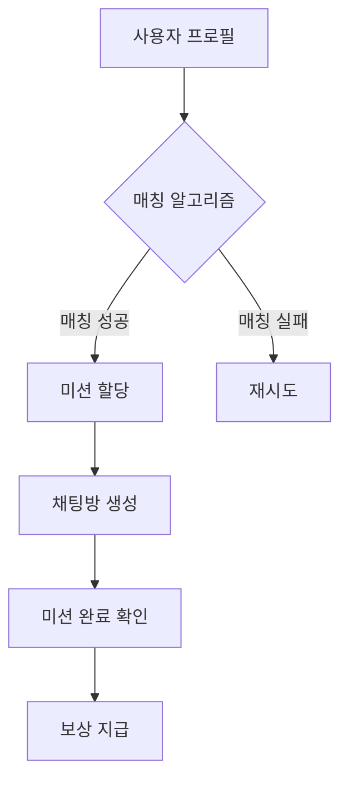
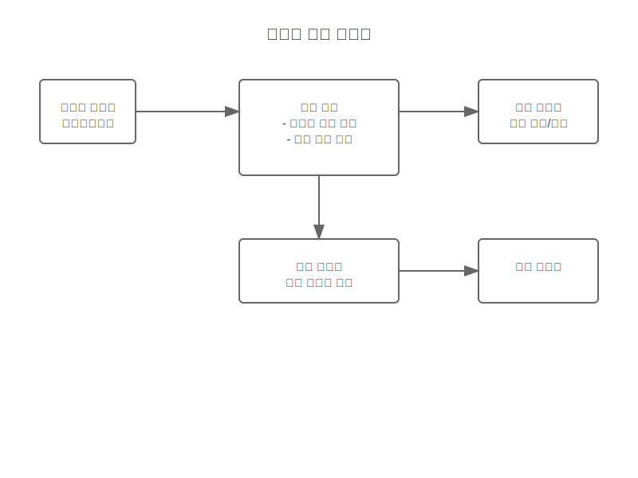
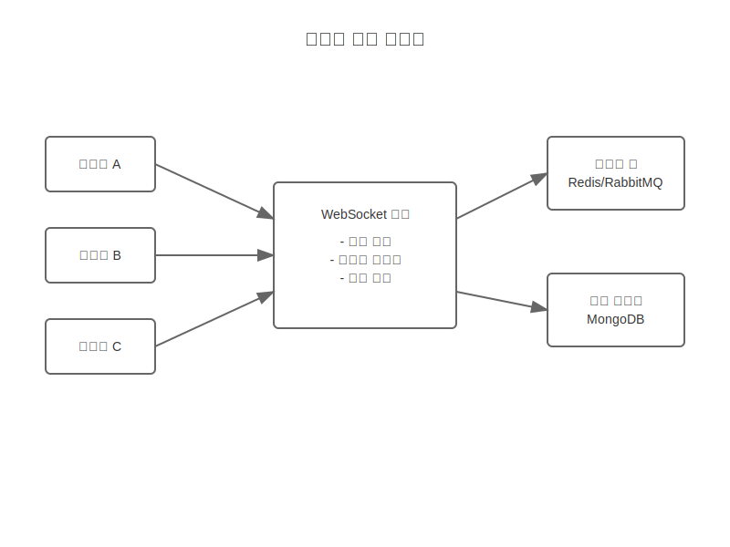

# 네트워킹 게임 시스템 흐름 스토리보드

## 개요
네트워킹 게임 확장 기능의 시스템 레벨 작동 방식과 사용자 매칭 알고리즘을 정의합니다.

## 시스템 구성요소
- 사용자 매칭 엔진
- 실시간 채팅 시스템
- 미션 관리 시스템
- 점수 및 보상 시스템

## 데이터 흐름

## 연동 지점
1. 사용자 프로필 시스템
2. 채팅 시스템
3. 보상 시스템
4. 분석 시스템

## 오류 처리
- 매칭 실패
- 채팅 연결 끊김
- 미션 검증 오류
- 동시 접속 문제

## 관련 시나리오
- [네트워킹 게임 흐름](/scenarios/system-scenarios/extensions/networking-game-flow.md)
- [사용자 매칭 알고리즘](/scenarios/system-scenarios/extensions/user-matching.md)

## 시스템 다이어그램

