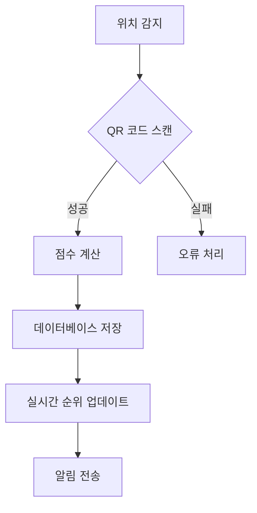
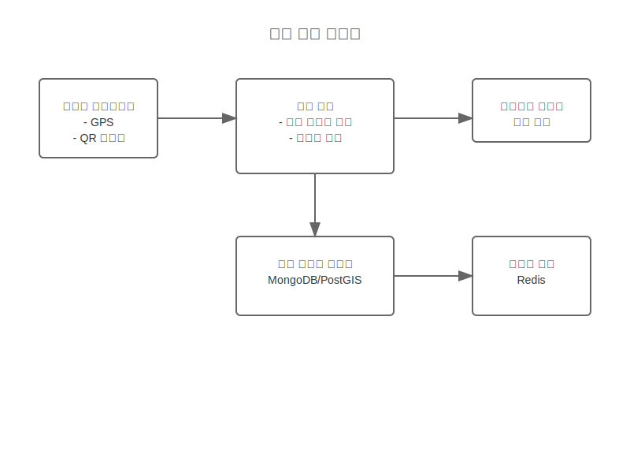
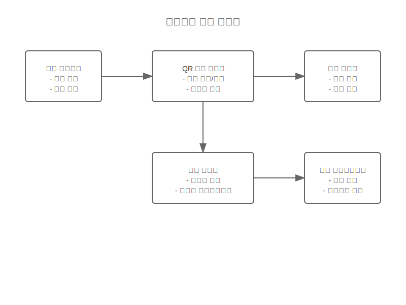

# 보물찾기 시스템 흐름 스토리보드

## 개요
보물찾기 확장 기능의 시스템 레벨 작동 방식과 데이터 흐름을 정의합니다.

## 시스템 구성요소
- 위치 추적 시스템
- QR 코드 생성/인식 모듈
- 점수 계산 엔진
- 실시간 알림 시스템

## 데이터 흐름

## 연동 지점
1. 게이트 관리 시스템
2. 사용자 인증 시스템
3. 알림 시스템
4. 분석 시스템

## 오류 처리
- QR 코드 인식 실패
- 위치 정보 오류
- 네트워크 연결 문제
- 동시 접속 처리

## 관련 시나리오
- [보물찾기 게임 흐름](/scenarios/system-scenarios/extensions/treasure-hunt-flow.md)
- [실시간 순위 처리](/scenarios/system-scenarios/extensions/realtime-ranking.md)

## 시스템 다이어그램

