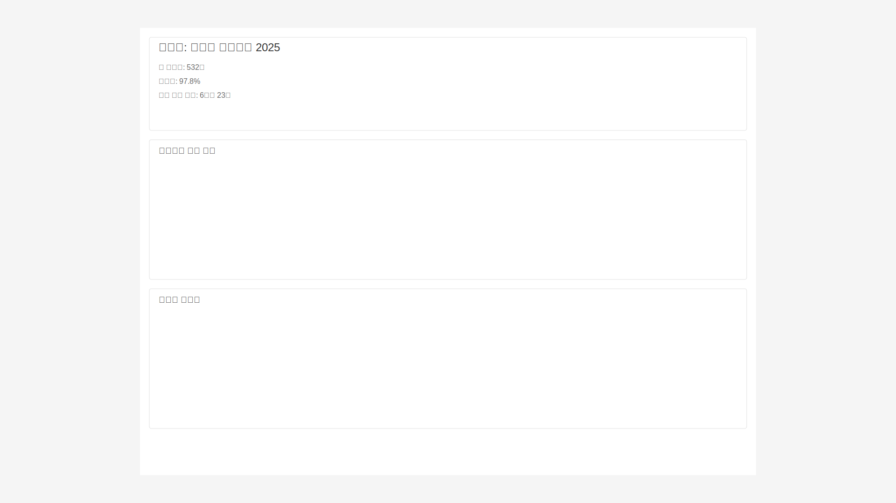

# 분석 대시보드 스토리보드

## 개요
이벤트 및 출석 데이터에 대한 종합적인 분석을 제공하는 대시보드입니다.

## 화면 1: 대시보드 메인

### 설명
- 주요 지표들을 한눈에 파악할 수 있는 대시보드 화면
- 일일 활성 사용자, 이벤트별 출석률, 사용자 참여도, 시간대별 활동 등 표시

### 상호작용
- 차트 영역 클릭: 상세 분석 화면으로 이동
- 기간 필터: 드롭다운으로 기간 선택
- 데이터 새로고침: 실시간 데이터 업데이트

### 접근성
- 모든 차트는 테이블 형태로도 제공
- 색상 대비 4.5:1 이상 유지
- 키보드 탐색 지원

## 화면 2: 이벤트 상세 분석

### 설명
- 개별 이벤트에 대한 상세 분석 제공
- 참석자 통계, 시간대별 분포, 세션별 참여도 등 표시

### 상호작용
- 데이터 필터링: 다중 필터 적용 가능
- 데이터 내보내기: CSV, PDF 형식 지원
- 차트 커스터마이징: 표시 항목 선택 가능

### 접근성
- 스크린리더 호환 데이터 테이블
- 대체 텍스트 제공
- 키보드 단축키 지원

## 화면 3: 실시간 모니터링

### 설명
- 현재 진행 중인 이벤트들의 실시간 현황 모니터링
- 시스템 상태 및 알림 표시

### 상호작용
- 실시간 업데이트: 3초마다 자동 갱신
- 알림 설정: 중요 지표별 알림 기준 설정
- 문제 해결: 이상 징후 발견 시 즉시 대응

### 접근성
- 동적 콘텐츠 변경 알림
- 고대비 모드 지원
- 음성 안내 지원

## 시스템 흐름

## 관련 시나리오
- [분석 대시보드 사용자 흐름](../../../../scenarios/extensions/analytics-dashboard/user-scenarios/dashboard-usage.md)
- [데이터 분석 시나리오](../../../../scenarios/extensions/analytics-dashboard/system-scenarios/data-analysis.md)
- [실시간 모니터링](../../../../scenarios/extensions/analytics-dashboard/system-scenarios/realtime-monitoring.md)
