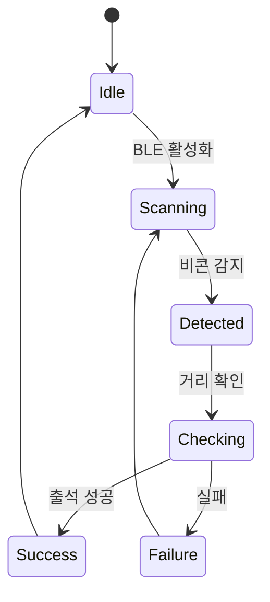
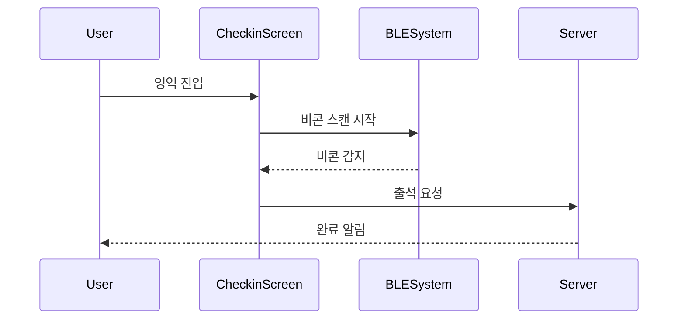
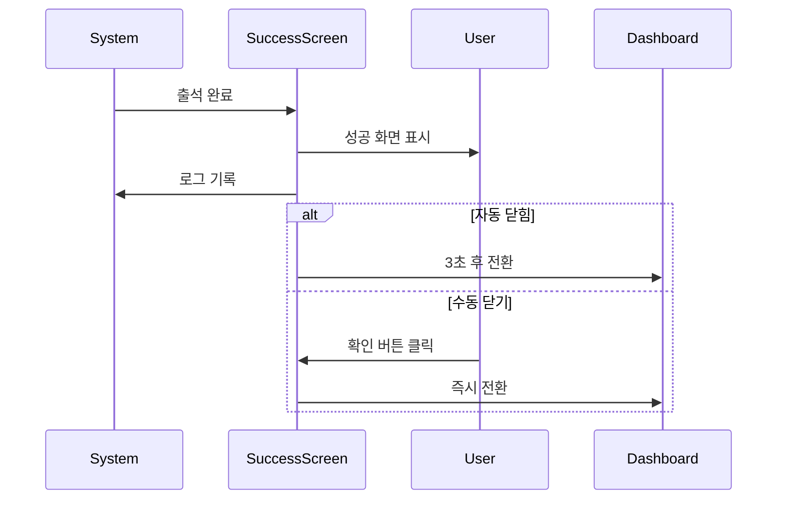
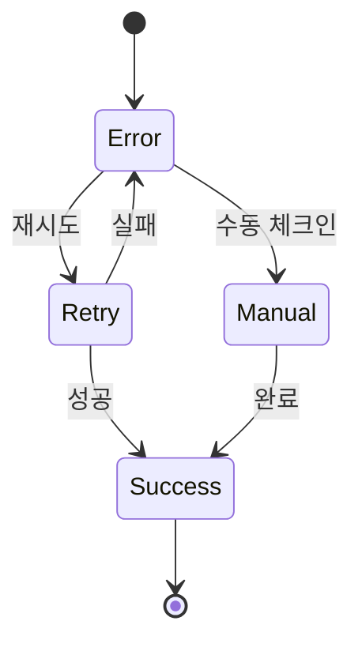

# 출석 체크 핵심 기능

## 화면 1: 메인 대시보드

### 설명
사용자의 현재 참여 이벤트와 출석 상태를 보여주는 메인 화면입니다.

### 화면 구성
- 상태 바 (상단)
  - BLE 상태
  - GPS 상태
  - 배터리 상태
- 활성 이벤트 카드 (중앙)
  - 이벤트 이름
  - 시간 정보
  - 출석 상태
- 빠른 액션 버튼 (하단)
  - 수동 체크인
  - QR 코드 스캔
  - 설정

### 상호작용
- 이벤트 카드 탭: 상세 정보 표시
- 상태 아이콘 탭: 상태 토글/설정
- 빠른 액션: 해당 기능으로 이동

### 접근성
- 상태 변경 음성 알림
- 터치 타겟 크기 최적화
- 상태 아이콘 대체 텍스트

## 화면 2: 출석 진행 상태

### 설명
BLE 비콘 감지 및 출석 처리 진행 상태를 보여주는 화면입니다.

### 화면 구성
- 진행 상태 표시기 (중앙)
  - 비콘 검색
  - 거리 측정
  - 인증 처리
  - 완료 확인
- 취소 버튼 (하단)
- 상태 메시지 (하단)

### 상호작용
- 자동 진행: 상태에 따른 자동 전환
- 취소 버튼: 프로세스 중단
- 오류 발생 시: 재시도 옵션

### 접근성
- 진행 상태 음성 안내
- 진동 피드백
- 취소 옵션 항상 제공

## 화면 3: 완료 확인

### 설명
출석 체크 완료 후 확인 화면입니다.

### 화면 구성
- 성공 애니메이션 (중앙)
- 확인 메시지
- 시간 정보
- 위치 정보
- 확인 버튼

### 상호작용
- 자동 닫힘 (3초 후)
- 확인 버튼: 즉시 닫기
- 세부정보 탭: 상세 정보 표시

### 접근성
- 성공 소리/진동 피드백
- 높은 대비의 성공 표시
- 충분한 표시 시간

## 화면 4: 오류 처리

### 설명
출석 체크 실패 시의 오류 처리 화면입니다.

### 화면 구성
- 오류 아이콘 (중앙)
- 오류 메시지
- 문제 해결 가이드
- 재시도 버튼
- 수동 체크인 옵션

### 상호작용
- 재시도 버튼: 프로세스 재시작
- 문제해결 가이드: 단계별 해결방법
- 수동 체크인: 대체 방법으로 전환

### 접근성
- 명확한 오류 설명
- 대체 방법 제공
- 도움말 쉽게 접근

