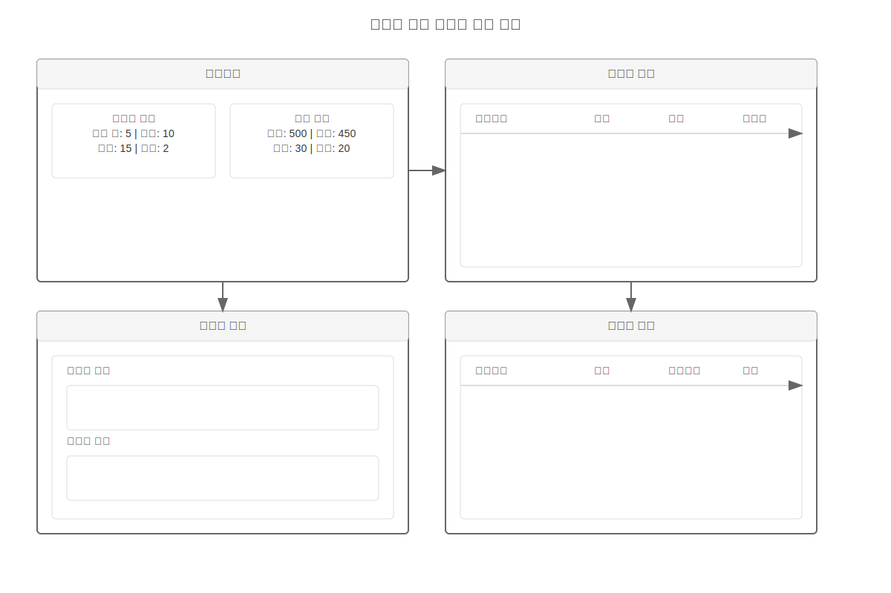
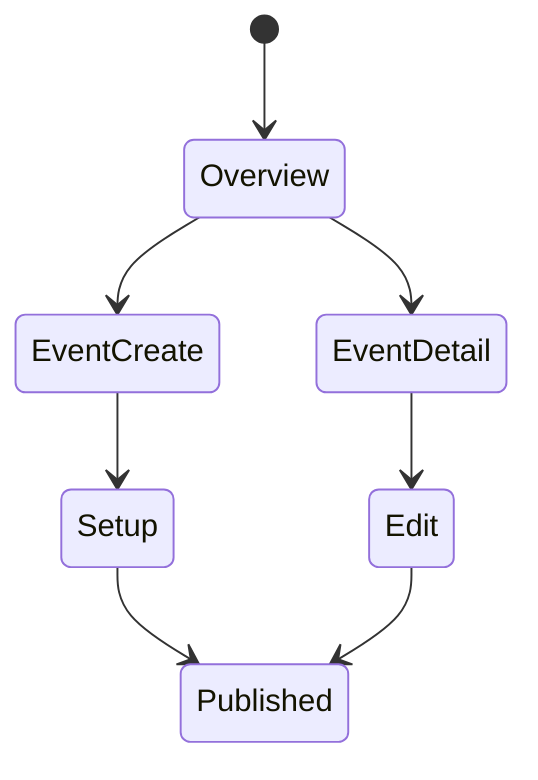
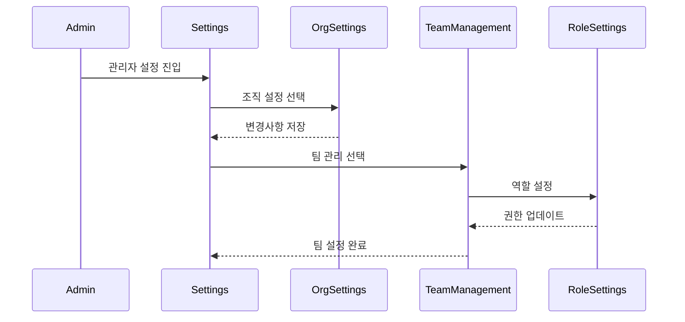

# 이벤트 관리 핵심 기능

## 주요 화면

## 개요

이벤트 관리 시스템은 이벤트 기획자와 운영자를 위한 웹 기반 플랫폼입니다. 본 문서는 핵심 사용자 흐름을 시각화합니다.

## 디자인 시스템

- **색상 팔레트**: #2196F3(주 색상), #4CAF50(성공), #FFC107(경고), #F44336(오류), #ECEFF1(배경)
- **타이포그래피**: 본문 - Noto Sans KR, 제목 - Montserrat
- **그리드 시스템**: 12컬럼 반응형 그리드

## 화면 1: 대시보드

### 설명
이벤트 관리자의 메인 작업 공간입니다.

### 화면 구성
- 상단 네비게이션 바
  - 이벤트 생성 버튼
  - 알림 센터
  - 사용자 프로필
- 이벤트 목록 (그리드 뷰)
- 퀵 액션 패널
- 통계 대시보드

### 상호작용
- 이벤트 카드 클릭: 상세 페이지로 이동
- 드래그 앤 드롭: 이벤트 우선순위 변경
- 필터링: 상태별 이벤트 정렬

### 접근성
- ARIA 레이블 적용
- 키보드 네비게이션
- 고대비 모드 지원

## 화면 2: 이벤트 설정

### 설명
새 이벤트 생성 및 설정 마법사입니다.

### 화면 구성
- 진행 단계 표시기
- 설정 폼
  - 기본 정보
  - 일정 설정
  - 참가자 관리
  - 출석 규칙
- 미리보기 패널

### 상호작용
- 단계별 이동
- 자동 저장
- 설정 검증

### 접근성
- 오류 메시지 음성 안내
- 단계별 포커스 관리
- 필수 항목 명확한 표시

## 화면 3: 참가자 관리

### 설명
이벤트 참가자 목록 및 관리 인터페이스입니다.

### 화면 구성
- 참가자 목록 (테이블 뷰)
- 일괄 작업 도구
- 참가자 상태 필터
- 검색 및 정렬 도구

### 상호작용
- 실시간 검색
- 상태 업데이트
- 일괄 작업
- 데이터 내보내기

### 접근성
- 테이블 네비게이션
- 상태 변경 알림
- 단축키 지원

## 화면 4: 실시간 모니터링

### 설명
이벤트 진행 상황 실시간 모니터링 화면입니다.

### 화면 구성
- 실시간 통계
- 출석 현황 그래프
- 알림 피드
- 문제 해결 도구

### 상호작용
- 실시간 데이터 갱신
- 필터링 및 정렬
- 즉각적인 조치 수행

### 접근성
- 실시간 업데이트 알림
- 데이터 시각화 대체 텍스트
- 키보드 단축키

## 화면 5: 분석 및 보고서

### 설명
이벤트 결과 분석 및 보고서 생성 인터페이스입니다.

### 화면 구성
- 데이터 시각화
- 보고서 템플릿
- 커스텀 분석 도구
- 내보내기 옵션

### 상호작용
- 보고서 커스터마이징
- 데이터 필터링
- 차트 상호작용
- 포맷 선택 및 다운로드

### 접근성
- 데이터 테이블 제공
- 차트 설명 텍스트
- 내보내기 포맷 다양화

## 화면 6: 시스템 설정

### 설명
이벤트 관리 시스템의 설정과 환경을 구성하는 관리자 인터페이스입니다.

### 화면 구성

#### 1. 조직 설정
- 조직 프로필 관리
- 브랜딩 설정
- 기본 연락처 정보
- 사업자 정보 관리

#### 2. 이벤트 기본값
- 기본 이벤트 템플릿
- 출석 체크 규칙
- 기본 알림 설정
- QR 코드 형식

#### 3. 팀 관리
- 팀원 초대/관리
- 역할 및 권한 설정
- 액세스 로그
- 팀 정책 설정

#### 4. 통합 관리
- API 키 관리
- Webhook 설정
- 외부 서비스 연동
- 데이터 동기화 설정

#### 5. 결제 및 구독
- 구독 플랜 관리
- 결제 내역
- 청구서 설정
- 환불 정책

### 상호작용

### 접근성

#### 관리자 인터페이스 접근성
- 역할 기반 화면 구성
- 빠른 작업 단축키
- 일괄 작업 지원

#### 데이터 입력 지원
- 폼 자동 완성
- 데이터 유효성 검증
- 실시간 피드백

#### 오류 복구
- 변경사항 자동 저장
- 실행 취소/복구
- 백업 및 복원

### 보안 고려사항
- 중요 설정 변경 시 2단계 인증
- 설정 변경 감사 로그
- IP 기반 접근 제한

## 관련 시나리오
- [사용자 흐름 시나리오](../../scenarios/user-scenarios/event-management/user-flow.md)
- [시스템 흐름 시나리오](../../scenarios/system-scenarios/event-management/system-flow.md)
