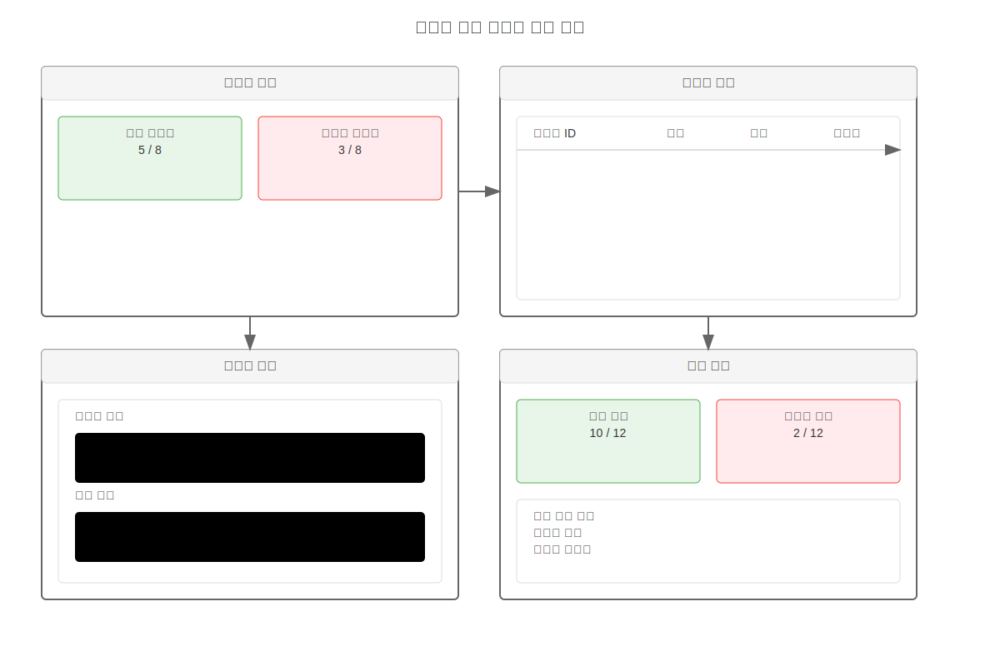
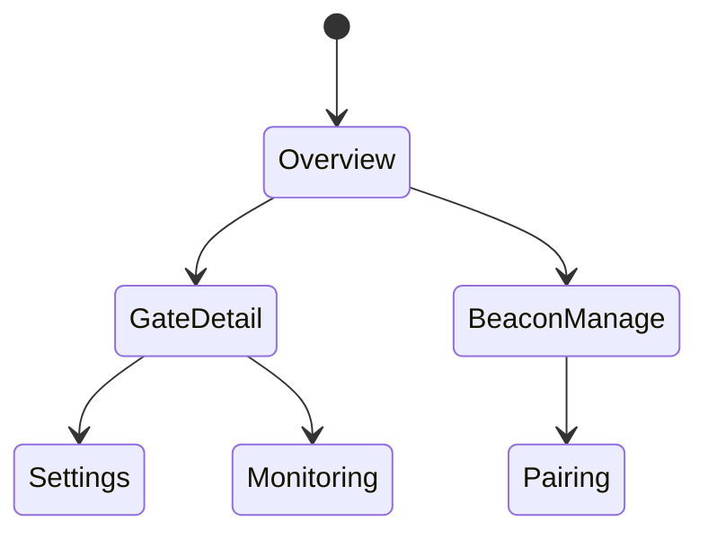
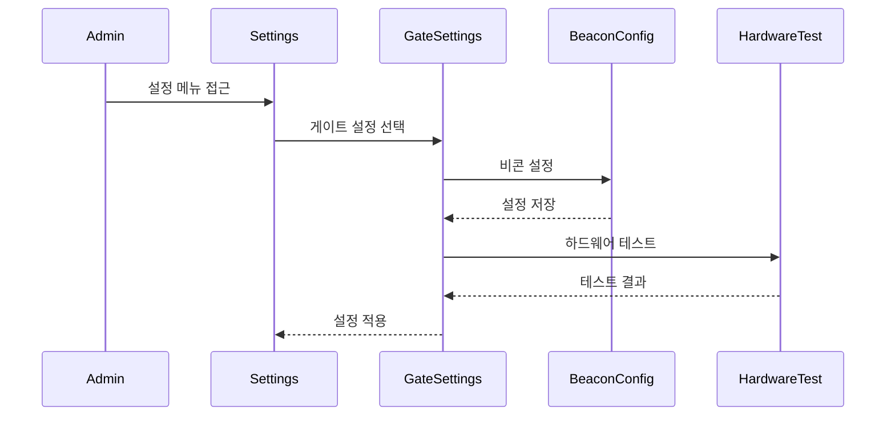

# 게이트 관리 핵심 기능

## 주요 화면

## 개요

게이트 관리 시스템은 물리적 게이트와 BLE 비콘을 관리하기 위한 인터페이스입니다. 본 문서는 핵심 사용자 흐름을 시각화합니다.

## 화면 1: 게이트 대시보드

### 설명
게이트 관리자의 메인 작업 공간입니다.

### 화면 구성
- 상태 개요 패널
  - 활성 게이트 수
  - 연결된 비콘 수
  - 시스템 상태
- 게이트 목록 (맵 뷰)
- 실시간 알림 피드
- 빠른 액션 도구

### 상호작용
- 게이트 선택: 상세 정보 표시
- 상태 필터링: 문제/정상 게이트
- 실시간 모니터링

### 접근성
- 맵 대체 목록 뷰
- 상태 변경 알림
- 키보드 네비게이션

## 화면 2: 비콘 관리

### 설명
BLE 비콘 설정 및 관리 인터페이스입니다.

### 화면 구성
- 비콘 목록
  - UUID
  - Major/Minor 값
  - 신호 강도
  - 배터리 상태
- 페어링 도구
- 설정 인터페이스
- 상태 모니터

### 상호작용
- 비콘 추가/제거
- 신호 강도 조정
- 페어링 프로세스
- 펌웨어 업데이트

### 접근성
- 명확한 상태 표시
- 단계별 설정 가이드
- 오류 복구 지원

## 화면 3: 게이트 설정

### 설명
개별 게이트의 상세 설정 인터페이스입니다.

### 화면 구성
- 게이트 정보
- 연결된 비콘 목록
- 접근 규칙 설정
- 하드웨어 설정

### 상호작용
- 설정 변경
- 비콘 매핑
- 테스트 모드
- 원격 제어

### 접근성
- 설정 검증
- 단계별 안내
- 원격 지원 옵션

## 화면 4: 모니터링

### 설명
게이트 시스템의 실시간 모니터링 화면입니다.

### 화면 구성
- 실시간 상태 표시
- 통과 기록
- 오류 로그
- 성능 메트릭

### 상호작용
- 실시간 데이터 갱신
- 로그 필터링
- 문제 해결 도구
- 보고서 생성

### 접근성
- 상태 변경 알림
- 로그 검색 도구
- 데이터 내보내기

## 화면 5: 시스템 설정

### 설명
게이트 관리 시스템의 하드웨어 및 소프트웨어 설정을 관리하는 인터페이스입니다.

### 화면 구성

#### 1. 게이트 기본 설정
- 게이트 동작 모드
- 접근 제어 규칙
- 운영 시간 설정
- 비상 모드 설정

#### 2. 비콘 관리
- 비콘 등록/삭제
- 신호 강도 설정
- 배터리 관리
- 비콘 매핑

#### 3. 하드웨어 설정
- 센서 캘리브레이션
- 전원 관리
- 네트워크 설정
- 펌웨어 업데이트

#### 4. 알림 설정
- 이벤트 알림 규칙
- 알림 수신자 관리
- 알림 채널 설정
- 긴급 알림 설정

#### 5. 시스템 관리
- 로그 설정
- 백업/복원
- 성능 모니터링
- 진단 도구

### 상호작용

### 접근성

#### 관리자 인터페이스
- 직관적인 네비게이션
- 빠른 설정 검색
- 설정 변경 이력

#### 하드웨어 상태 표시
- 시각적 상태 표시
- 청각적 알림
- 촉각적 피드백

#### 문제 해결
- 자가 진단 도구
- 문제 해결 가이드
- 원격 지원 도구

### 보안 설정
- 물리적 접근 제어
- 네트워크 보안
- 데이터 암호화
- 감사 로그

## 관련 시나리오
- [게이트 설정 시나리오](../../scenarios/user-scenarios/gate-management/setup-flow.md)
- [비콘 관리 시나리오](../../scenarios/system-scenarios/gate-management/beacon-management.md)
