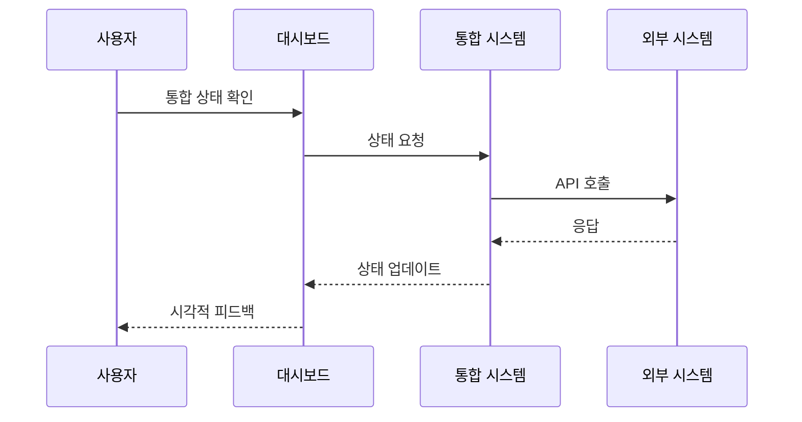
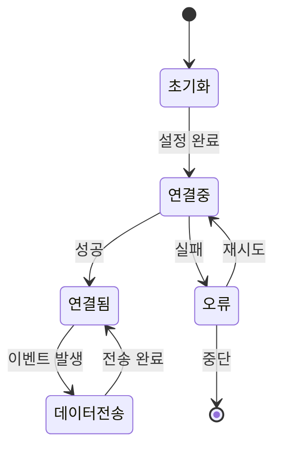

# 시스템 통합 스토리보드

## 개요
외부 시스템과의 통합을 위한 흐름을 정의하는 스토리보드입니다. CRM, 마케팅 도구, 분석 플랫폼 등과의 연동 방식을 시각화합니다.

## 화면 1: 통합 대시보드
### 설명
- 모든 연동된 시스템의 상태와 데이터 흐름을 보여주는 중앙 대시보드
- 실시간 연동 상태 모니터링
- 오류 발생 시 즉시 알림

### 상호작용
- 시스템 상태 클릭: 상세 정보 표시
- 오류 알림 클릭: 문제 해결 가이드 표시
- 데이터 흐름 그래프: 마우스 오버 시 상세 지표 표시

### 접근성
- 색상으로 표시된 상태 정보는 아이콘과 텍스트로도 제공
- 키보드 네비게이션 지원
- 스크린리더용 상태 설명 제공

## 화면 2: 통합 설정
### 설명
- 새로운 시스템 연동 설정
- API 키 및 엔드포인트 구성
- 데이터 매핑 설정

### 상호작용
- 시스템 선택 드롭다운
- API 키 입력 및 검증
- 테스트 연결 버튼
- 데이터 필드 매핑 UI

### 접근성
- 명확한 레이블과 설명
- 폼 검증 오류 명시적 표시
- 단계별 설정 가이드

## 화면 3: 데이터 흐름 모니터링
### 설명
- 실시간 데이터 전송 상태
- 이벤트별 데이터 흐름 시각화
- 오류 및 지연 표시

### 상호작용
- 타임라인 줌 인/아웃
- 이벤트 필터링
- 오류 상세정보 표시

### 접근성
- 대비 높은 그래프 색상
- 키보드로 데이터 포인트 탐색 가능
- 청각적 피드백 옵션

## 화면 4: 오류 해결 가이드
### 설명
- 단계별 문제 해결 가이드
- 자동 진단 결과
- 해결 방안 추천

### 상호작용
- 문제 유형 선택
- 단계별 해결 진행
- 해결 성공/실패 피드백

### 접근성
- 명확한 단계 구분
- 진행 상태 표시
- 오디오 가이드 지원

## 화면 5: 데이터 매핑 설정
### 설명
- 필드별 데이터 매핑
- 변환 규칙 설정
- 테스트 데이터 미리보기

### 상호작용
- 드래그 앤 드롭 필드 매핑
- 변환 규칙 편집기
- 실시간 미리보기

### 접근성
- 키보드로 필드 매핑 가능
- 고대비 모드 지원
- 명확한 피드백 메시지

## 화면 6: 통계 및 리포트
### 설명
- 통합 성능 지표
- 데이터 전송량 통계
- 오류율 및 지연시간

### 상호작용
- 기간 선택
- 지표 필터링
- 리포트 내보내기

### 접근성
- 데이터 테이블 제공
- 대체 텍스트 설명
- 키보드 단축키 지원

## 화면 7: 알림 설정
### 설명
- 알림 규칙 설정
- 수신자 관리
- 알림 채널 설정

### 상호작용
- 알림 조건 설정
- 수신자 추가/제거
- 채널별 설정

### 접근성
- 명확한 설정 구조
- 오류 메시지 음성 안내
- 탭 순서 최적화

## 관련 시나리오
- [시스템 통합 흐름](/scenarios/system-scenarios/integrated-platform/integration-flow.md)
- [데이터 동기화 시나리오](/scenarios/system-scenarios/integrated-platform/data-sync.md)
- [오류 처리 시나리오](/scenarios/system-scenarios/integrated-platform/error-handling.md)

## 시스템 흐름

## 상태 전이

