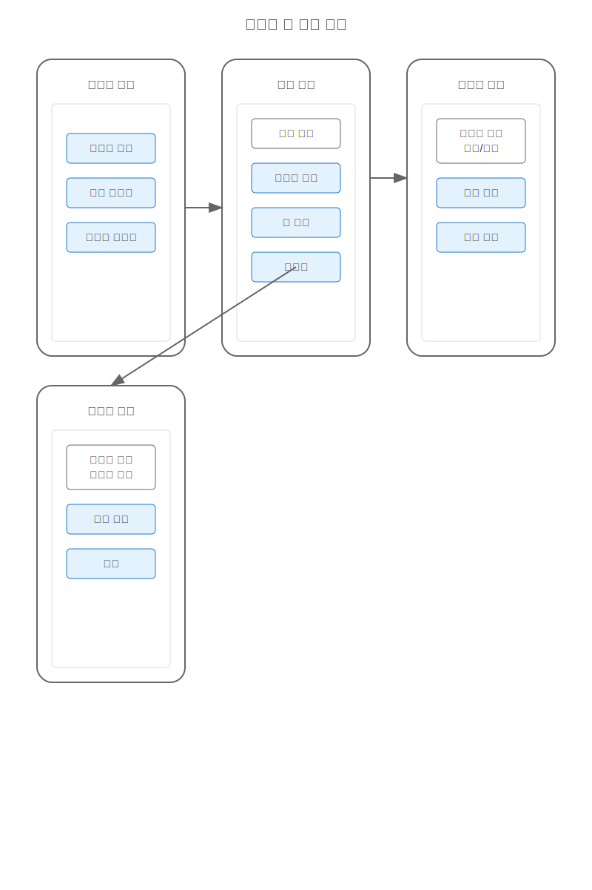
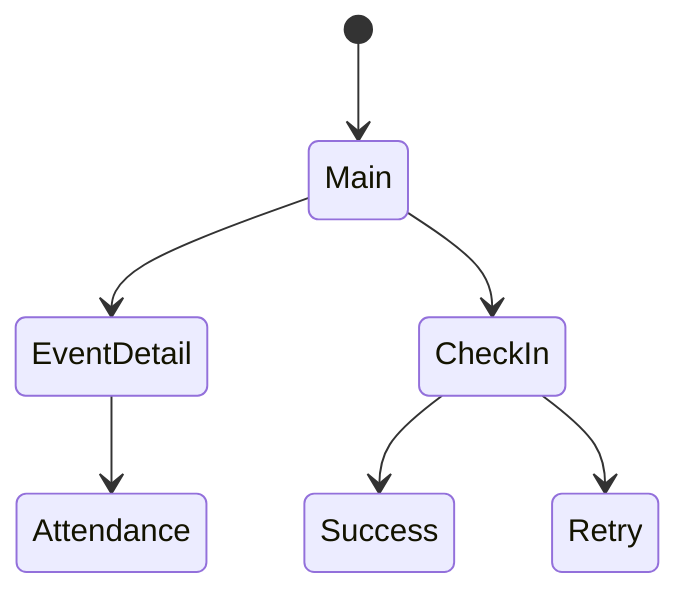
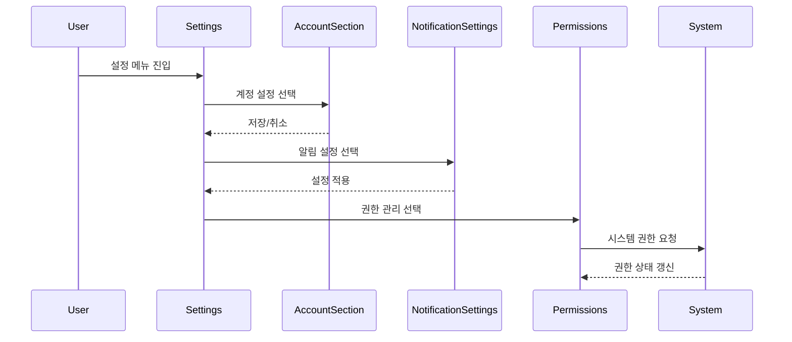

# 모바일 앱 핵심 기능

## 주요 화면

## 개요

모바일 출석 체크 앱은 사용자가 이벤트에 참여하고 자동으로 출석을 체크하기 위한 핵심 인터페이스입니다.

## 화면 1: 메인 화면

### 설명
사용자의 메인 인터페이스입니다.

### 화면 구성
- 상태 바
  - BLE 상태
  - 위치 서비스
  - 배터리 상태
- 활성 이벤트 카드
- 최근 활동 이력
- 바로가기 메뉴

### 상호작용
- 이벤트 선택
- 자동 체크인
- 상태 토글
- 활동 확인

### 접근성
- 음성 안내
- 진동 피드백
- 고대비 모드

## 화면 2: 이벤트 상세

### 설명
선택한 이벤트의 상세 정보 화면입니다.

### 화면 구성
- 이벤트 정보
  - 시간/장소
  - 참여 상태
  - 체크인 정보
- 지도 뷰
- 참가자 목록
- 공지사항

### 상호작용
- 체크인 시작
- 위치 확인
- 정보 갱신
- 알림 설정

### 접근성
- 위치 음성 안내
- 거리 정보 표시
- 접근성 라벨

## 화면 3: 자동 체크인

### 설명
BLE 비콘을 통한 자동 체크인 프로세스 화면입니다.

### 화면 구성
- 진행 상태
- 비콘 신호 강도
- 위치 정보
- 취소 옵션

### 상호작용
- 자동 감지
- 수동 시작
- 상태 확인
- 오류 복구

### 접근성
- 진행 상태 알림
- 진동 피드백
- 음성 안내

## 화면 4: 출석 확인

### 설명
출석 체크 완료 후 확인 화면입니다.

### 화면 구성
- 성공 표시
- 체크인 시간
- 위치 정보
- 추가 정보

### 상호작용
- 상세 정보 확인
- 이력 저장
- 공유 옵션
- 피드백 제공

### 접근성
- 완료 알림
- 상태 음성 안내
- 대체 텍스트

## 화면 5: 설정

### 설명
사용자 앱의 모든 설정을 관리하는 중앙 인터페이스입니다.

### 화면 구성

#### 1. 계정 섹션
- 프로필 사진 및 기본 정보
- 비밀번호 변경
- 계정 연동 관리
- 계정 삭제

#### 2. 알림 설정
- 푸시 알림 설정
  - 이벤트 알림
  - 출석 확인 알림
  - 마케팅 알림
- 알림음 설정
- 진동 설정

#### 3. 권한 관리
- Bluetooth 권한
- 위치 서비스 권한
- 알림 권한
- 카메라 권한

#### 4. 앱 설정
- 언어 설정
- 테마 설정 (라이트/다크)
- 글꼴 크기
- 데이터 사용 관리

#### 5. 지원
- 도움말
- FAQ
- 문의하기
- 개인정보 처리방침
- 이용약관

### 상호작용

### 접근성

#### 스크린리더 지원
- 모든 설정 항목에 명확한 레이블 제공
- 계층 구조 인식 가능한 그룹핑
- 상태 변경 시 음성 피드백

#### 키보드/스위치 제어
- 모든 설정 항목을 키보드로 접근 가능
- 논리적인 탭 순서
- 단축키 지원

#### 시각적 접근성
- 고대비 모드 지원
- 글꼴 크기 조절 가능
- 컬러 블라인드 대응 디자인

### 에러 처리
- 설정 저장 실패 시 복구 옵션
- 네트워크 오류 시 오프라인 모드 지원
- 권한 거부 시 대체 기능 안내

## 관련 시나리오
- [자동 체크인 시나리오](../../scenarios/user-scenarios/user-app/auto-checkin.md)
- [수동 체크인 시나리오](../../scenarios/user-scenarios/user-app/manual-checkin.md)
