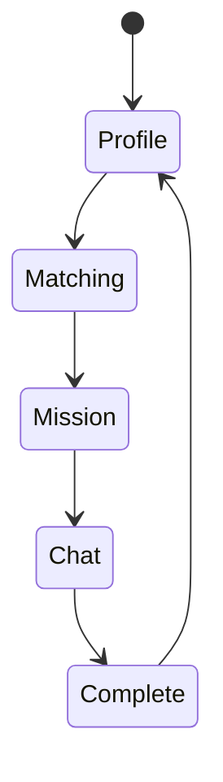

# 네트워킹 게임

## 개요

참가자들 간의 상호작용을 촉진하는 소셜 네트워킹 게임입니다. BLE 기술을 활용하여 참가자 매칭과 미션을 제공합니다.

## 화면 1: 네트워킹 대시보드

### 설명
현재 진행 중인 네트워킹 활동과 매칭 상태를 보여줍니다.

### 화면 구성
- 프로필 카드
- 매칭 상태
- 활성 미션
- 연결 통계

### 상호작용
- 프로필 편집
- 매칭 시작
- 미션 수락
- 대화 시작

### 접근성
- 프로필 읽기
- 상태 알림
- 쉬운 탐색

## 화면 2: 매칭 프로세스

### 설명
참가자 매칭 및 초기 상호작용 화면입니다.

### 화면 구성
- 매칭 진행바
- 관심사 태그
- 추천 참가자
- 대화 시작점

### 상호작용
- 매칭 수락/거절
- 관심사 선택
- 대화 시작
- 프로필 확인

### 접근성
- 매칭 알림
- 쉬운 응답
- 대체 텍스트

## 화면 3: 미션 활동

### 설명
매칭된 참가자와 함께하는 미션 화면입니다.

### 화면 구성
- 미션 설명
- 진행 상태
- 협력 도구
- 완료 확인

### 상호작용
- 미션 시작
- 협력 활동
- 진행 체크
- 완료 인증

### 접근성
- 단계별 안내
- 시간 조절
- 도움말

## 화면 4: 네트워크 맵

### 설명
형성된 네트워크와 연결 상태를 시각화합니다.

### 화면 구성
- 네트워크 그래프
- 연결 정보
- 활동 이력
- 추천 연결

### 상호작용
- 맵 탐색
- 연결 관리
- 메시지 전송
- 필터링

### 접근성
- 그래프 설명
- 키보드 탐색
- 확대/축소

## 관련 시나리오
- [매칭 알고리즘](../../scenarios/extensions/networking-game/matching.md)
- [미션 시스템](../../scenarios/extensions/networking-game/missions.md)
