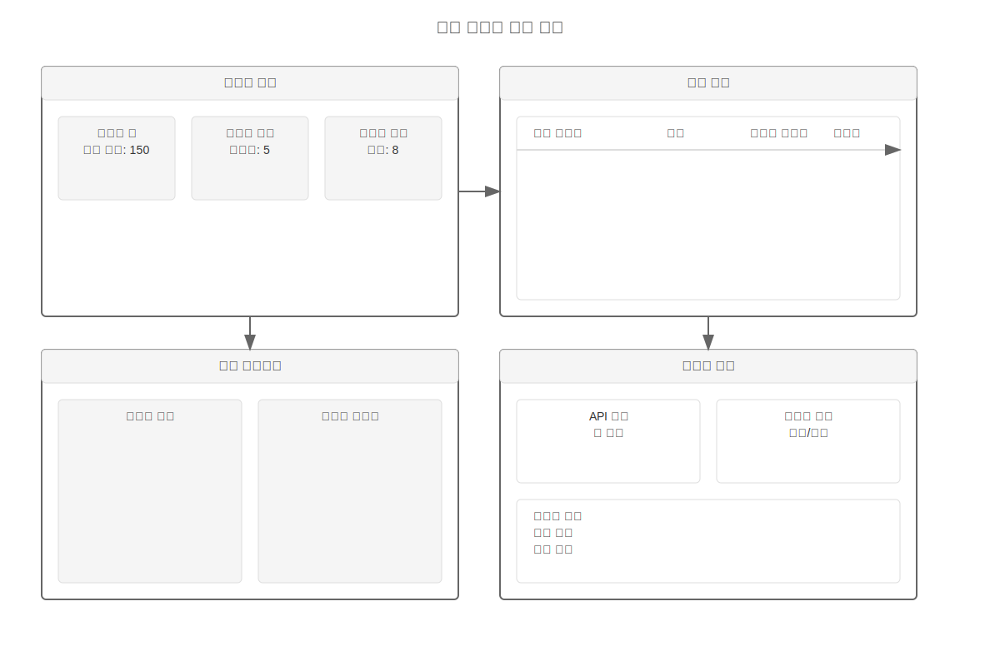
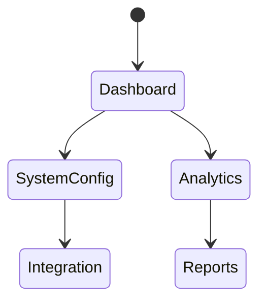
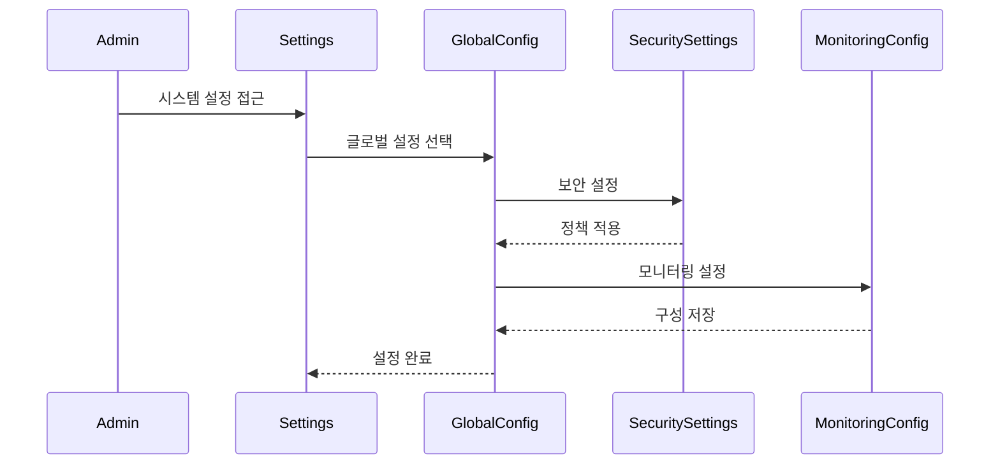

# 통합 플랫폼 핵심 기능

## 주요 컴포넌트

### 1. 통합 대시보드
- 시스템 전체 상태 모니터링
- 실시간 성능 메트릭
- 주요 알림 및 이벤트

### 2. 시스템 설정
- 구성요소 설정 관리
- 연동 설정
- 보안 및 권한 관리

### 3. 데이터 분석
- 통합 데이터 분석
- 리포트 생성
- 데이터 시각화

## 개요

통합 플랫폼은 모든 시스템 구성요소를 연결하고 통합된 관리 경험을 제공합니다.

## 화면 1: 통합 대시보드

### 설명
시스템 전체의 상태와 성능을 한눈에 보여주는 대시보드입니다.

### 화면 구성
- 시스템 상태 개요
  - 모든 구성요소 상태
  - 성능 메트릭
  - 주요 알림
- 통계 대시보드
- 퀵 액션 패널
- 알림 센터

### 상호작용
- 구성요소 관리
- 설정 변경
- 성능 모니터링
- 문제 해결

### 접근성
- 상태 변경 알림
- 대시보드 사용자화
- 키보드 탐색

## 화면 2: 시스템 설정

### 설명
통합 시스템의 설정 및 구성 관리 화면입니다.

### 화면 구성
- 구성요소 설정
- 연동 관리
- 권한 설정
- 알림 규칙

### 상호작용
- 설정 변경
- 구성 테스트
- 권한 관리
- 규칙 설정

### 접근성
- 설정 그룹화
- 단계별 안내
- 검증 피드백

## 화면 3: 데이터 분석

### 설명
통합된 데이터 분석 및 보고 인터페이스입니다.

### 화면 구성
- 분석 대시보드
- 데이터 시각화
- 보고서 생성기
- 데이터 내보내기

### 상호작용
- 데이터 필터링
- 차트 커스터마이징
- 보고서 생성
- 데이터 공유

### 접근성
- 차트 대체 텍스트
- 데이터 테이블 제공
- 키보드 단축키

## 화면 4: 연동 관리

### 설명
외부 시스템 연동 관리 인터페이스입니다.

### 화면 구성
- 연동 목록
- API 관리
- 웹훅 설정
- 로그 뷰어

### 상호작용
- 연동 추가/제거
- API 키 관리
- 웹훅 구성
- 로그 분석

### 접근성
- 설정 검증
- 오류 안내
- 상태 알림

## 화면 5: 시스템 설정

### 설명
통합 플랫폼의 전체 시스템 설정을 관리하는 고급 관리자 인터페이스입니다.

### 화면 구성

#### 1. 시스템 설정
- 글로벌 환경 설정
- 성능 최적화 설정
- 리소스 할당
- 시스템 정책

#### 2. 통합 설정
- 서비스 연동 관리
- API 게이트웨이 설정
- 데이터 동기화 규칙
- 서비스 디스커버리

#### 3. 보안 설정
- 접근 제어 정책
- 인증/인가 설정
- 암호화 정책
- 보안 감사 설정

#### 4. 모니터링 설정
- 성능 메트릭 구성
- 알림 규칙
- 로그 관리
- 대시보드 설정

#### 5. 데이터 관리
- 데이터 보존 정책
- 백업 스케줄
- 아카이빙 규칙
- 복구 계획

### 상호작용

### 접근성

#### 관리자 경험
- 역할 기반 설정 접근
- 설정 검색 및 필터
- 빠른 작업 단축키

#### 데이터 시각화
- 설정 영향 미리보기
- 시스템 상태 시각화
- 성능 메트릭 그래프

#### 변경 관리
- 설정 변경 승인 절차
- 변경 이력 추적
- 롤백 메커니즘

### 보안 고려사항
- 다중 인증
- 세션 관리
- 감사 로그
- IP 기반 접근 제어

## 관련 시나리오
- [시스템 통합 시나리오](../../scenarios/system-scenarios/integrated-platform/integration-flow.md)
- [데이터 분석 시나리오](../../scenarios/user-scenarios/integrated-platform/analytics-flow.md)
