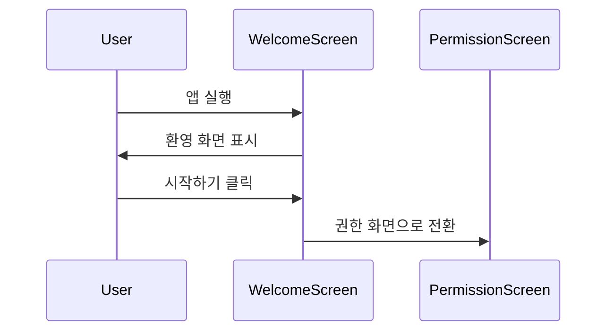
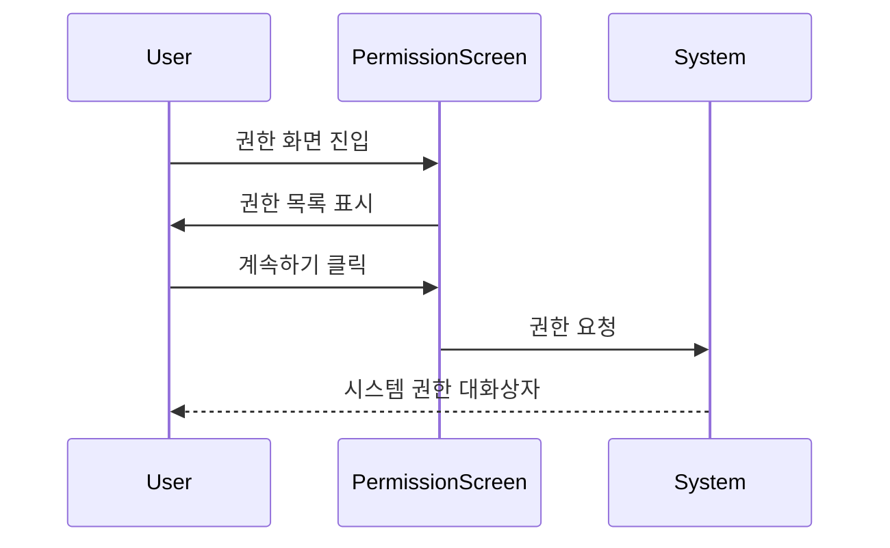
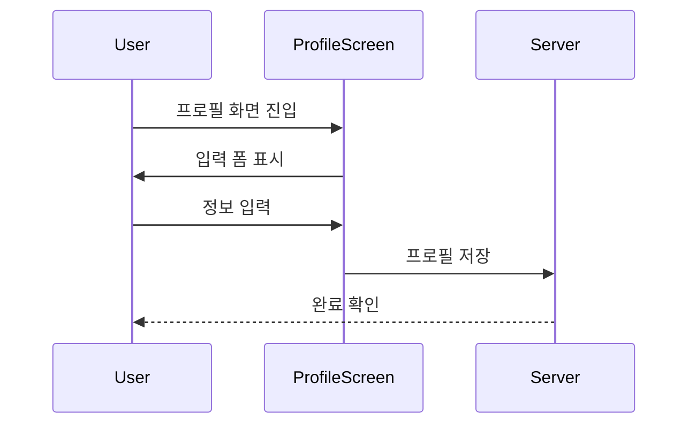
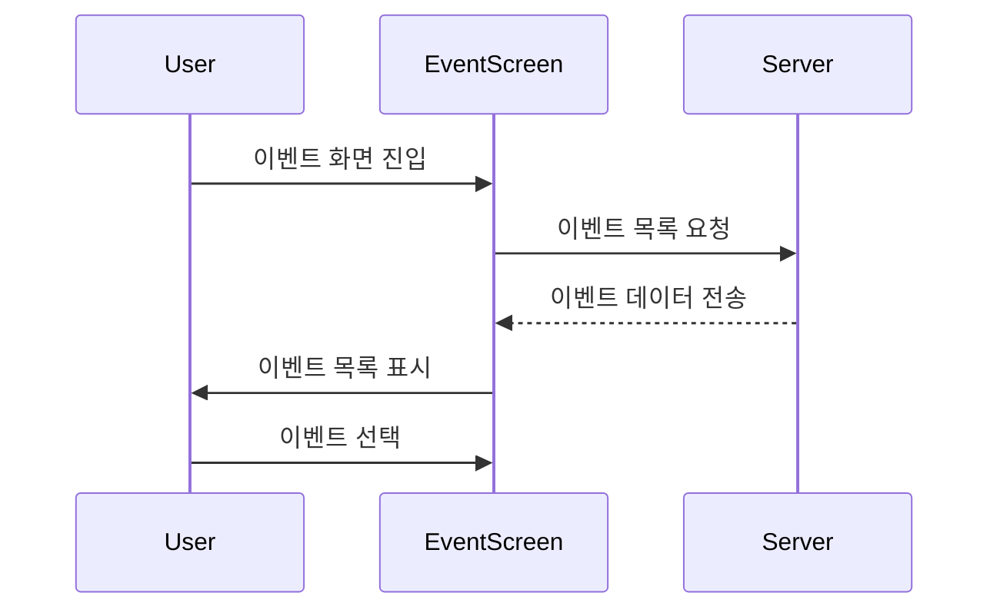
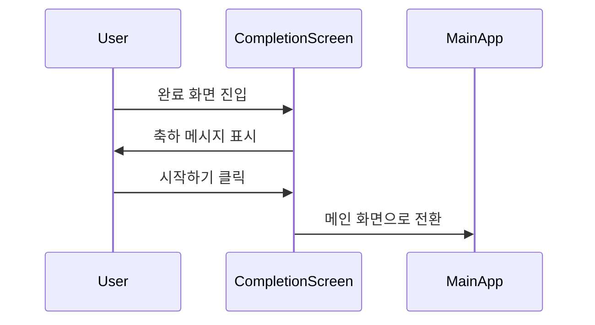

# S-Attend-Gate 온보딩 프로세스

## 화면 1: 웰컴 스크린

### 설명
첫 실행 시 사용자를 맞이하는 웰컴 화면입니다.

### 화면 구성
- 로고 영역 (상단 중앙)
- 환영 메시지 (중앙)
- 시작하기 버튼 (하단)
- 언어 선택 옵션 (우측 상단)

### 상호작용
- 시작하기 버튼 탭: 다음 화면으로 전환
- 언어 선택: 드롭다운에서 언어 변경

### 접근성
- 모든 텍스트는 최소 18pt
- 고대비 모드 지원
- 스크린리더 호환 레이블

## 화면 2: 권한 요청

### 설명
필수 권한에 대한 설명과 승인 요청 화면입니다.

### 화면 구성
- 권한 설명 영역 (상단)
- 각 권한 항목 리스트 (중앙)
  - Bluetooth 권한
  - 위치 권한
  - 알림 권한
- 계속하기 버튼 (하단)

### 상호작용
- 각 권한 설명 탭: 상세 정보 표시
- 계속하기 버튼: 시스템 권한 요청 대화상자 표시

### 접근성
- 각 권한의 목적 명확히 설명
- 키보드 탐색 지원
- 취소 및 나중에 하기 옵션 제공

## 화면 3: 프로필 설정

### 설명
사용자 기본 정보 입력 화면입니다.

### 화면 구성
- 프로필 이미지 업로드 (선택사항)
- 이름 입력 필드
- 이메일 입력 필드
- 전화번호 입력 필드 (선택사항)
- 저장 버튼

### 상호작용
- 이미지 업로드: 갤러리/카메라 선택
- 입력 필드: 실시간 유효성 검사
- 저장 버튼: 프로필 정보 저장

### 접근성
- 명확한 오류 메시지
- 필수 필드 표시
- 자동완성 지원

## 화면 4: 이벤트 선택

### 설명
참여 가능한 이벤트 목록 화면입니다.

### 화면 구성
- 이벤트 검색바 (상단)
- 이벤트 카테고리 필터 (상단)
- 이벤트 목록 (중앙)
  - 이벤트 카드
    - 이벤트 이름
    - 날짜/시간
    - 장소
    - 참여 버튼

### 상호작용
- 검색: 실시간 필터링
- 카테고리 선택: 목록 필터링
- 이벤트 카드: 상세 정보 표시
- 참여 버튼: 이벤트 등록

### 접근성
- 검색 결과 음성 안내
- 카드 포커스 시각화
- 스와이프 제스처 지원

## 화면 5: 완료 화면

### 설명
온보딩 완료 및 시작 화면입니다.

### 화면 구성
- 완료 메시지 (중앙)
- 애니메이션 효과
- 시작하기 버튼 (하단)
- 튜토리얼 제안 (선택사항)

### 상호작용
- 시작하기 버튼: 메인 화면으로 전환
- 튜토리얼 링크: 상세 가이드로 이동

### 접근성
- 애니메이션 건너뛰기 옵션
- 명확한 완료 상태 안내
- 키보드 단축키 지원

