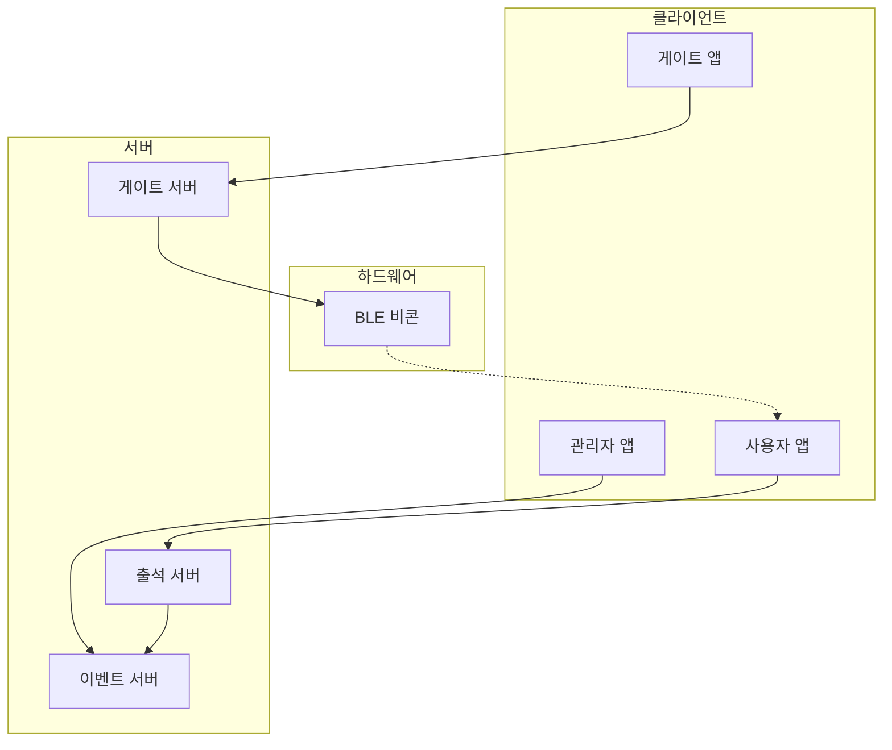

# S-Attend-Gate

BLE 비콘을 활용한 자동 출석 체크 시스템

## 📌 개요

S-Attend-Gate는 BLE 비콘 기술을 활용하여 사용자의 출석을 자동으로 체크하고 관리하는 시스템입니다. GPS 위치 검증과 결합하여 높은 정확도와 신뢰성을 제공합니다.

## 🚀 주요 기능

- BLE 비콘 기반 자동 출석 감지
- GPS 위치 검증
- 실시간 알림
- QR 코드 백업 시스템
- 게임화 요소 (보물찾기)
- 관리자 대시보드

## 🏗️ 시스템 구성



## 🔍 문서화

프로젝트 문서는 다음 위치에서 확인할 수 있습니다:

- [기본 개념](/.concepts/base.md)
- [개발 우선순위](/.concepts/development-priority.md)
- [API 문서](/.concepts/scenarios/system-scenarios/core-apis)

### 문서 구조

```
.concepts/
├── base.md                    # 초기 컨셉트
├── development-priority.md    # 개발 우선순위
└── scenarios/                 # 상세 시나리오
    ├── system-scenarios/     # 시스템 시나리오
    └── user-scenarios/       # 사용자 시나리오
```

## 🚀 시작하기

### 필요 조건

- Node.js 18 이상
- Python 3.9 이상
- BLE 지원 하드웨어

### 설치 방법

추후 업데이트 예정

## 📅 개발 일정

- Phase 1 (P0): 7주 - 핵심 시스템 구축
- Phase 2 (P1): 8주 - 시스템 안정화
- Phase 3 (P2): 11주 - 시스템 고도화
- Phase 4 (Future): 14주 - 시스템 확장

## 📊 성능 목표

- BLE 감지 성공률: 95% 이상
- GPS 위치 정확도: 10m 이내
- 시스템 가용성: 99.9%
- API 응답 시간: 100ms 이내

## 🤝 기여하기

프로젝트 기여 가이드라인은 추후 업데이트 예정입니다.

## 📜 라이선스

추후 업데이트 예정
